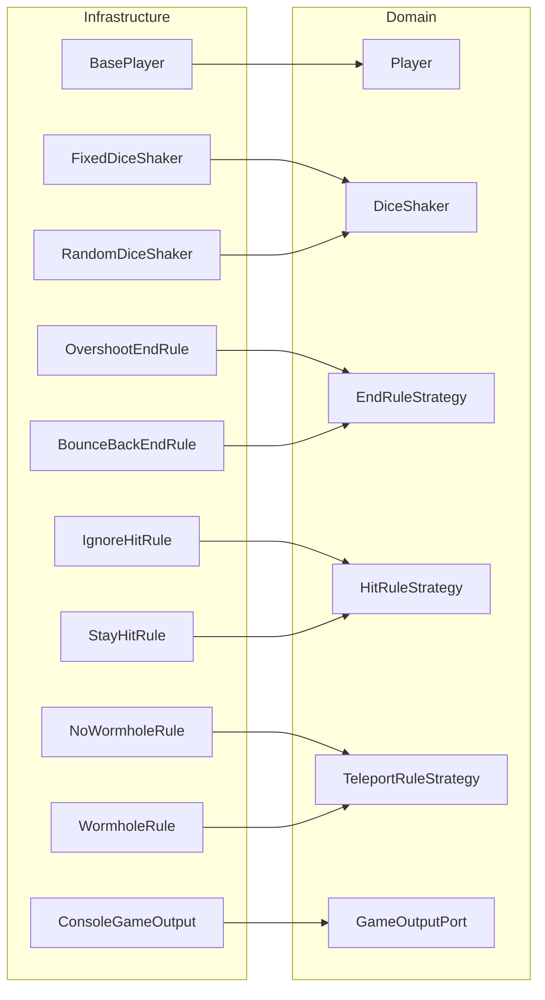
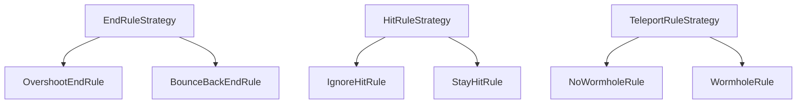

# Snakes and Ladders — Software Design and Architecture Coursework

## Overview
This project is a Java console simulation of Snakes and Ladders built using Spring Boot, Clean Architecture, and the Strategy design pattern. It supports two and four player games across two board sizes with configurable end rules, hit rules, and wormhole teleportation.

## How to Run
1. Clone the repository
2. Open in IntelliJ IDEA and allow Maven to load `pom.xml`
3. Run `GameApplication.java` — Spring Boot starts and calls `GameRunner.runAll()`
4. All seven game configurations print to the console automatically

## Clean Architecture — Ports and Adapters
The project is structured into three layers. Dependencies only flow inward the infrastructure depends on Usecase and domain, Usecase depends only on domain, and domain has no dependencies at all.

## Project Structure

## Design Patterns

### Strategy Pattern
The Strategy pattern is used three times, once for each variable game behaviour. Each strategy is an interface in the domain layer with implementations in the infrastructure layer.

**EndRuleStrategy** = defines `applyRule(int currentIndex, int steps, int endIndex)`
- `OvershootEndRule` = returns `endIndex` if the player overshoots, allowing any roll to win
- `BounceBackEndRule` = calculates the overshoot amount and bounces the player back from the end

**HitRuleStrategy** = defines `allowMove(int newPosition, int otherPlayerPosition)`
- `IgnoreHitRule` = always returns `true`, multiple players can share a position
- `StayHitRule` = returns `false` when positions match, forfeiting the turn

**TeleportRuleStrategy** = defines `applyRule(int position)`
- `NoWormholeRule` = always returns the same position unchanged
- `WormholeRule` = stores wormhole pairs in a `HashMap` and returns the teleport destination if the position matches

The pattern allows `Game.java` to call `hitRule.allowMove()`, `teleportRule.applyRule()`, and `endRule.applyRule()` without knowing which implementation is active. New rules can be added by creating a new class implementing the interface without modifying `Game.java`.
## SOLID Principles

### Single Responsibility Principle
Each class has one job. `Game.java` manages game flow only. `ConsoleGameOutput` handles output only. `BounceBackEndRule` calculates bounce logic only. `GameRunner` assembles and runs games only.

### Open/Closed Principle
`Game.java` is closed for modification but open for extension. Adding a new end rule requires only a new class implementing `EndRuleStrategy` — no changes to `Game.java` are needed.

### Liskov Substitution Principle
`OvershootEndRule` and `BounceBackEndRule` can be changed in `Game.java` because both implement `EndRuleStrategy`. The game behaves correctly with either implementation substituted.

### Interface Segregation Principle
Three small focused interfaces are used — `EndRuleStrategy`, `HitRuleStrategy`, and `TeleportRuleStrategy` — rather than one large rule interface. Classes only implement the methods they need.

### Dependency Inversion Principle
`Game.java` depends on `Player` and `GameOutputPort` interfaces, not on `BasePlayer` or `ConsoleGameOutput` directly. Spring Boot injects `ConsoleGameOutput` into `GameRunner` via the `@Component` annotation and constructor injection, meaning `GameRunner` never calls `new ConsoleGameOutput()`.
## Game Variations

| Game | Board | Players | End Rule | Hit Rule | Teleport | Dice |
|------|-------|---------|----------|----------|----------|------|
| Game 1 | 5x5 | 2 | Overshoot | Ignore | None | Fixed 2 dice |
| Game 2 | 5x5 | 2 | Bounce Back | Ignore | None | Fixed 2 dice |
| Game 3 | 5x5 | 2 | Overshoot | Stay | None | Fixed 2 dice |
| Game 4 | 5x5 | 2 | Overshoot | Ignore | Wormhole | Fixed 2 dice |
| Game 5 | 5x5 | 2 | Overshoot | Ignore | None | Random 1 die |
| Game 6 | 5x5 | 2 | Bounce Back | Stay | None | Random 2 dice |
| Game 7 | 6x6 | 4 | Overshoot | Ignore | None | Fixed 2 dice |

## Strategy Pattern Diagram

## Testing
Five unit tests were written to verify the core strategy classes behave correctly:

- `OvershootEndRuleTest` — verifies `applyRule()` returns `endIndex` when the player overshoots
- `BounceBackEndRuleTest` — verifies `applyRule()` correctly calculates the bounce-back index
- `WormholeRuleTest` — verifies `applyRule()` teleports to the correct destination and that wormholes are bidirectional
- `StayHitRuleTest` — verifies `allowMove()` returns `false` when positions match
- `IgnoreHitRuleTest` — verifies `allowMove()` always returns `true`

## Evaluation
The implementation successfully applies Clean Architecture, the Strategy pattern, and SOLID principles across all seven game configurations. The use of the `Player` interface in `Game.java` means the game loop is fully decoupled from `BasePlayer`. The `GameOutputPort` port ensures output is completely separated from game logic. If I had more time I would implement a state machine to formally model game states such as Ready, InPlay, and GameOver, and add a game replay feature to save and replay previous games.I would also be more disciplined with my git comits, committing after each meaningful change with clear commit messages to better document the development process.